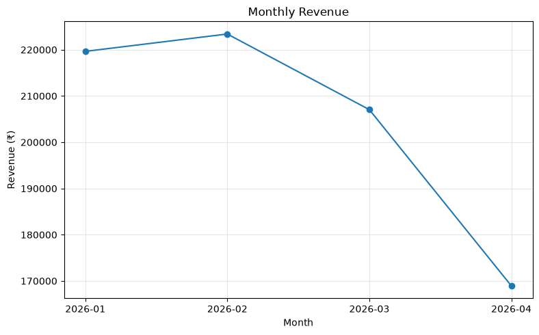
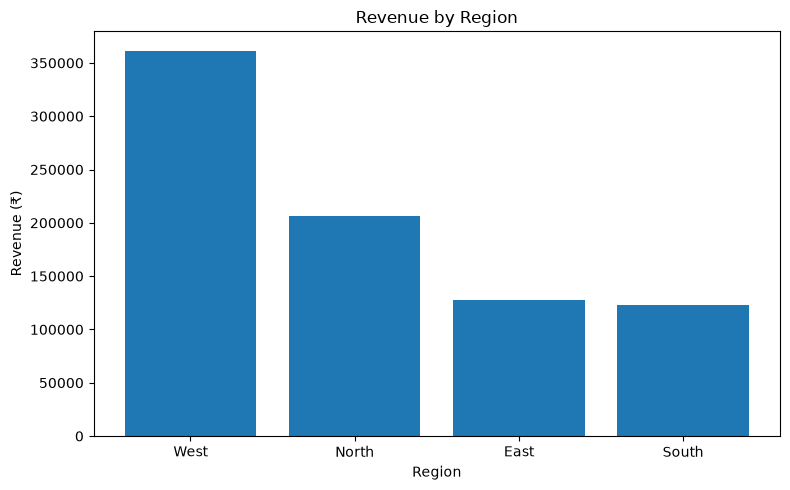
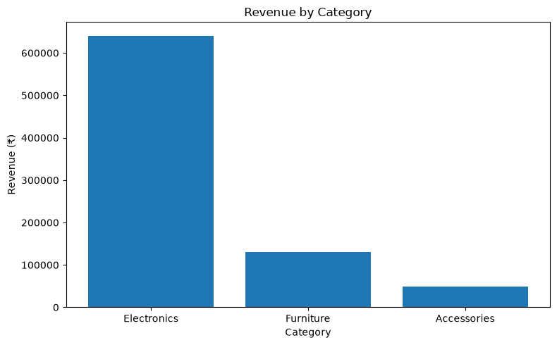
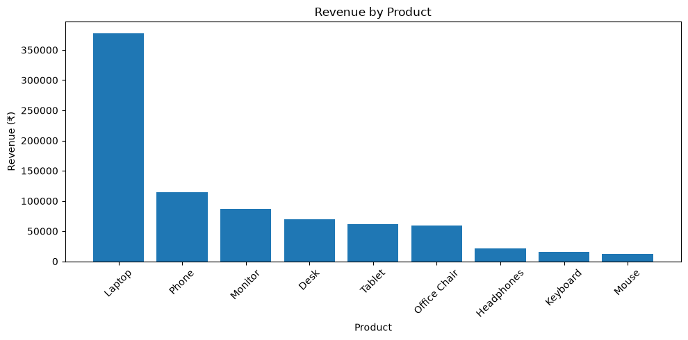
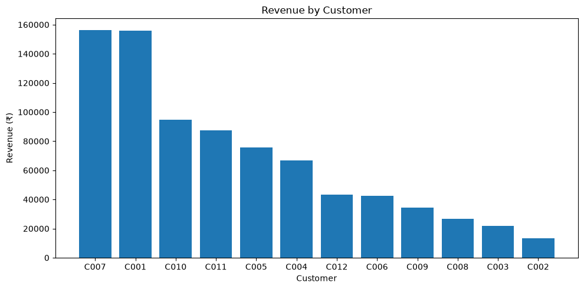
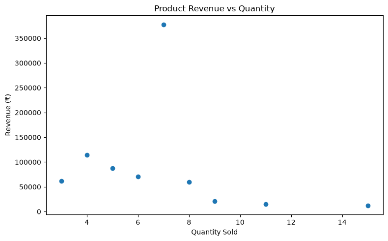

# Sales Analysis using Python

##  Project Overview

This project analyzes sales transaction data using Python to understand revenue performance, customer behavior, product performance, regional trends, discounts, and monthly sales patterns.

The objective is to transform raw sales data into meaningful business insights that can support data-driven decision-making.

---

##  Business Questions

This analysis answers the following questions:

- What is the total revenue generated?
- Which customers generate the most revenue?
- Which products contribute the most to revenue?
- Which categories perform best?
- Which regions generate the highest revenue?
- How is revenue changing month over month?
- Which products have high sales volume but relatively low revenue?
- How are discounts distributed across categories?
- Is revenue concentrated among a small number of customers or products?
- What business areas should be investigated further?

---

##  Tools & Technologies

- Python
- Pandas
- NumPy
- Matplotlib
- Jupyter Notebook
- VS Code

---

##  Dataset

The dataset contains **30 sales transactions** with the following fields:

| Column | Description |
|---|---|
| `order_id` | Unique order identifier |
| `order_date` | Date of the order |
| `customer_id` | Unique customer identifier |
| `product` | Product purchased |
| `category` | Product category |
| `quantity` | Number of units purchased |
| `price` | Unit price |
| `discount` | Discount applied |
| `region` | Sales region |

---

##  Analysis Workflow

The project follows an end-to-end data analysis workflow:

```text
Raw Data
   ↓
Data Loading
   ↓
Data Cleaning
   ↓
Feature Engineering
   ↓
KPI Analysis
   ↓
Exploratory Data Analysis
   ↓
Data Visualization
   ↓
Business Insights
   ↓
Business Recommendations
```

---

##  Data Preparation

The following data preparation steps were performed:

- Loaded the CSV dataset using Pandas
- Checked dataset dimensions
- Checked data types
- Checked missing values
- Checked duplicate records
- Converted `order_date` into datetime format
- Created a calculated `revenue` column

### Revenue Calculation

```python
revenue = quantity × price × (1 - discount)
```

---

##  Key KPIs

| KPI | Value |
|---|---:|
| Total Revenue | ₹819,050 |
| Total Orders | 30 |
| Unique Customers | 12 |
| Average Order Value | ₹27,301.67 |

---

##  Analysis Performed

### 1. Customer Analysis

Analyzed:

- Revenue by customer
- Orders per customer
- Average Order Value
- Customer revenue contribution
- Customer value segmentation

Customers were segmented into:

- High Value
- Medium Value
- Low Value

The **5 High Value customers contributed approximately 69.60% of total revenue**.

---

### 2. Product Analysis

Analyzed:

- Revenue by product
- Quantity sold
- Number of orders
- Revenue per unit
- Revenue contribution

The **Laptop generated the highest revenue at ₹377,800**, contributing approximately **46.13% of total revenue**.

---

### 3. Category Analysis

Revenue by category:

| Category | Revenue |
|---|---:|
| Electronics | ₹640,800 |
| Furniture | ₹129,700 |
| Accessories | ₹48,550 |

Electronics generated approximately **78.24% of total revenue**.

Interestingly, Accessories had the highest sales volume in terms of units, showing that sales volume does not necessarily translate into higher revenue.

---

### 4. Regional Analysis

Revenue by region:

| Region | Revenue |
|---|---:|
| West | ₹361,550 |
| North | ₹206,600 |
| East | ₹127,550 |
| South | ₹123,350 |

The **West region generated the highest revenue**, contributing approximately **44.14% of total revenue**.

It also had the highest regional Average Order Value at approximately **₹21,268**.

---

### 5. Time Analysis

Monthly revenue was analyzed to understand sales trends.

| Month | Revenue |
|---|---:|
| January | ₹219,650 |
| February | ₹223,400 |
| March | ₹207,050 |
| April | ₹168,950 |

Revenue peaked in February and declined during March and April.

April recorded approximately **18.40% lower revenue compared with March**.

The decline was accompanied by fewer orders, while Average Order Value increased.

---

### 6. Discount Analysis

Discount levels were analyzed against:

- Number of orders
- Revenue
- Average Order Value
- Revenue contribution

The analysis helps identify how discounts are distributed across different categories and transaction groups.

The dataset is relatively small, so the analysis does not assume that discounts directly cause changes in revenue.

---

## 📊 Visualizations

### Monthly Revenue Trend



The monthly trend shows that revenue peaked in February and declined during March and April.

---

### Revenue by Region



West generated the highest revenue among the four regions.

---

### Revenue by Category



Electronics contributed the majority of total revenue, while Accessories had the highest unit volume.

---

### Revenue by Product



Laptop was the highest revenue-generating product in the dataset.

---

### Revenue by Customer



Revenue is concentrated among a smaller group of high-value customers.

---

### Product Revenue vs Quantity



The scatter plot highlights the difference between product sales volume and revenue contribution.
---

## 💡 Key Insights

### 1. Revenue declined after February

Revenue reached its highest point in February at **₹223,400** and then declined in March and April.

April recorded the lowest monthly revenue at **₹168,950**.

---

### 2. West is the largest revenue-generating region

West contributed approximately **44.14% of total revenue**, making it the largest regional contributor in this dataset.

---

### 3. Electronics dominates revenue

Electronics generated **₹640,800**, approximately **78.24% of total revenue**.

This indicates a strong dependence on the Electronics category.

---

### 4. Laptop is the strongest revenue product

Laptop generated **₹377,800**, representing approximately **46.13% of total revenue**.

However, it sold only 7 units, demonstrating that high revenue can come from relatively low sales volume when product value is high.

---

### 5. Revenue is concentrated among high-value customers

The 5 High Value customers contributed approximately **69.60% of total revenue**.

This indicates significant customer revenue concentration.

---

### 6. Sales volume does not always mean high revenue

Mouse had the highest quantity sold at **15 units**, but generated only **₹12,000**.

Laptop sold only **7 units** but generated **₹377,800**.

This demonstrates the difference between sales volume and revenue contribution.

---

##  Business Recommendations

Based on the analysis:

1. Investigate the decline in order volume during March and April.
2. Monitor the dependency on high-revenue products such as Laptop.
3. Analyze regional performance differences to understand why revenue varies significantly across regions.
4. Monitor high-value customer concentration and customer retention.
5. Evaluate discounts using revenue, order volume, and profitability rather than assuming higher discounts automatically improve performance.

---

## ⚠️ Analysis Limitations

This dataset contains only **30 transactions**, so the findings should be treated as exploratory rather than representative of a large real-world business.

Some groups also contain a small number of transactions.

Therefore:

- Trends should be validated with a larger dataset.
- Discount analysis should not be interpreted as causal.
- Customer and product concentration should be monitored over a longer period.
- Further analysis could include profit margin, acquisition cost, customer retention, and marketing data.

---

## 📁 Project Structure

```text
Sales_Analysis_Project/
│
├── data/
│   └── sales.csv
│
├── notebooks/
│   └── sales_analysis_final.ipynb
│
├── README.md
│
└── requirements.txt
```

---

##  Future Improvements

Possible extensions of this project include:

- Customer retention analysis
- Cohort analysis
- Profit and margin analysis
- Customer Lifetime Value
- Sales forecasting
- Interactive dashboard using Power BI
- Automated reporting
- Larger real-world datasets

---

##  Conclusion

This project demonstrates an end-to-end Python data analysis workflow, from loading and cleaning raw data to generating KPIs, performing exploratory analysis, creating visualizations, and translating findings into business recommendations.

The analysis highlights important patterns in revenue, customers, products, categories, regions, discounts, and monthly performance.

The project demonstrates practical use of **Python, Pandas, NumPy, and Matplotlib** for solving business-oriented data analysis problems.
